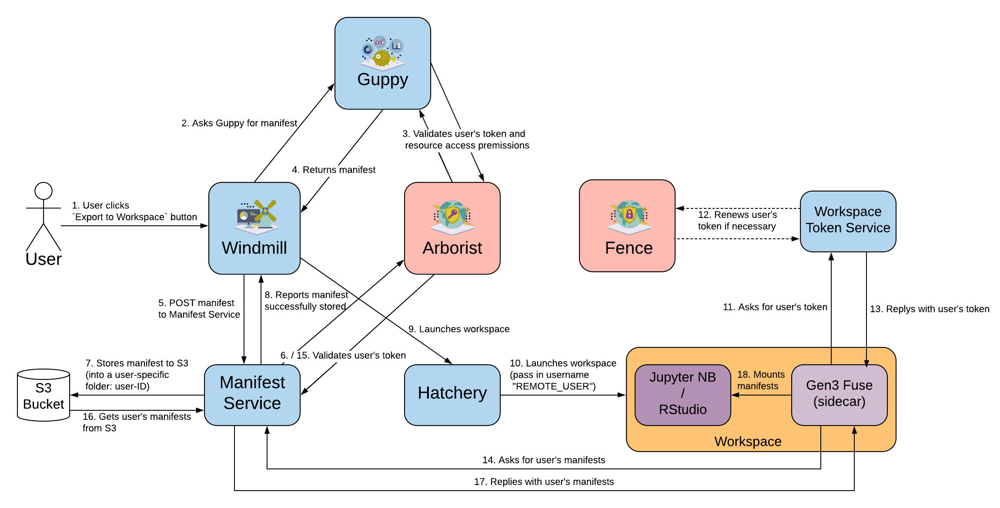

# Workspace Token Service (WTS)

The reason we need this service is that a worker within a workspace is not tied to an active user web session, so there isn't an easy way for users within a worker to call Gen3 services other than manually copying the token into the worker.

The Gen3 workspace token service acts as an OIDC client which acts on behalf of users to request refresh tokens from [Fence](https://github.com/uc-cdis/fence). This happens when a user logs into a workspace from the browser. WTS then stores the refresh token for that user, and manages access tokens and refresh tokens for workers that belong to specific users in the workspace.

Each type of workspace environment should have a corresponding auth mechanism for the service to check the identity of a worker. Currently WTS has a K8s auth plugin that supports workers deployed as K8s pods with username annotation.

OpenAPI Specification [here](http://petstore.swagger.io/?url=https://raw.githubusercontent.com/uc-cdis/workspace-token-service/master/openapi/swagger.yaml).


## How a workspace interacts with WTS

- The workspace UI calls `/oauth2/authorization_url` to connect with Fence during user login, this will do an OIDC dance with fence to obtain a refresh token if it's a new user or if the user's previous refresh token is expired.
- The worker calls `/token?expires=seconds` to get an access token


## Why isn't WTS part of Fence?

With the workspace architecture illustrated below, the `/token` endpoint [trusts](https://github.com/uc-cdis/workspace-token-service/blob/master/wts/auth_plugins/k8s.py) the caller ([Gen3Fuse](https://github.com/uc-cdis/gen3-fuse)) to pass the correct user identity.


## Gen3 Workspace architecture

[](https://www.lucidchart.com/documents/edit/e844ca6b-fb75-460c-8a8e-5ddb4a17b8d9/0_0)


## Configuration

`dbcreds.json`:
```
{
  "db_host": "xxx",
  "db_username": "xxx",
  "db_password": "xxx",
  "db_database": "xxx"
}
```

`appcreds.json`:

```
{
    "wts_base_url": "https://my-data-commons.net/wts/",
    "encryption_key": "xxx",
    "secret_key": "xxx",

    "fence_base_url": "https://my-data-commons.net/user/",
    "oidc_client_id": "xxx",
    "oidc_client_secret": "xxx",

    "external_oidc": [
        {
            "base_url": "https://other-data-commons.net",
            "oidc_client_id": "xxx",
            "oidc_client_secret": "xxx",
            "redirect_uri": "https://shared.redirect/whatever",
            "login_options": {
                "other-google": {
                    "name": "Other Commons Google Login",
                    "params": {
                        "idp": "google"
                   }
                },
                "other-orcid": {
                    "name": "Other Commons ORCID Login",
                    "params": {
                        "idp": "fence",
                        "fence_idp": "orcid"
                   }
                },
                ...
            }
        },
        ...
    ]
}
```

The default OIDC client configuration (`fence_base_url`, `oidc_client_id` and `oidc_client_secret`) is generated automatically during `gen3 kube-setup-wts`. Other clients can be created by running the following command in the external Fence: `fence-create client-create --client wts-my-data-commons --urls https://my-data-commons.net/wts/oauth2/authorize --username <your username>`, which returns a `(key id, secret key)` tuple. Any login option that is configured in the external Fence (the list is served at `https://other-data-commons.net/user/login`) can be configured here in the `login_options` section.

Note that IDP IDs (`other-google` and `other-orcid` in the example above) must be unique _across the whole `external_oidc` block_.

Also note that the OIDC clients you create must be granted `read-storage` access to all the data in the external
Data Commons via the data-commons' `user.yaml`.

Finally, the `redirect_uri` property for external OIDC providers is
an optional field that supports sharing OIDC client
configuration between multiple workspace deployments
as part of a multi-account application system.


## Dev-Test

### Start database

```
cat - > docker-compose.yml <<EOM
EOM

docker-compose up -d
psql -c 'create database wts_test;' -U postgres -h localhost
```

### Setup and run tests

Local development like this:

```
pipenv shell
pipenv install --dev
pytest
```

### Test on kubernetes

Open a `devterm` in the jupyter namespace:
```
gen3 devterm --namespace "$(gen3 jupyter j-namespace)" --user frickjack@uchicago.edu
```

Interact with the WTS:
```
WTS="http://workspace-token-service.${NAMESPACE:-${KUBECTL_NAMESPACE##jupyter-pods-}}.svc.cluster.local"
curl $WTS/
curl $WTS/external_oidc/ | jq -r .
curl $WTS/token/?idp=default
```

### Initiate an OAUTH handshake

First, login to the commons: https://your.commons/user/login/google?redirect=https://your.commons/user/user

Now try to acquire an access token for some idp:
https://your.commons/wts/oauth2/authorization_url?idp=default
